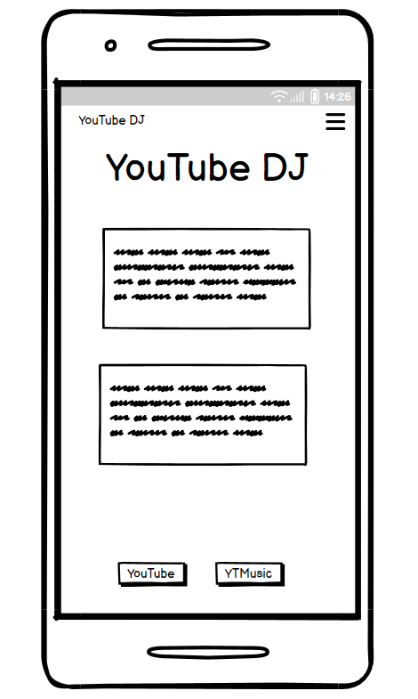
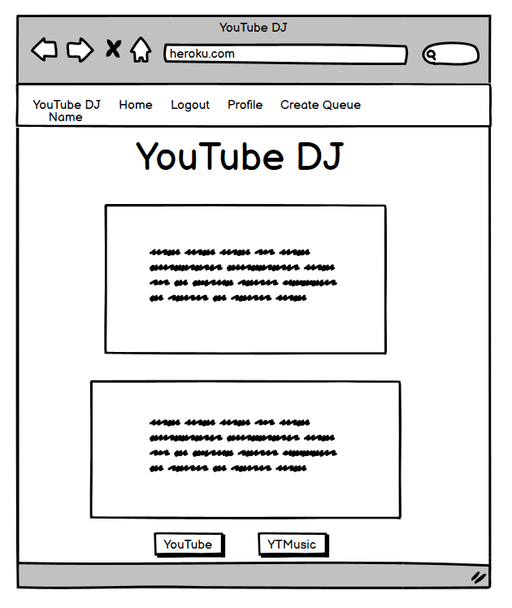
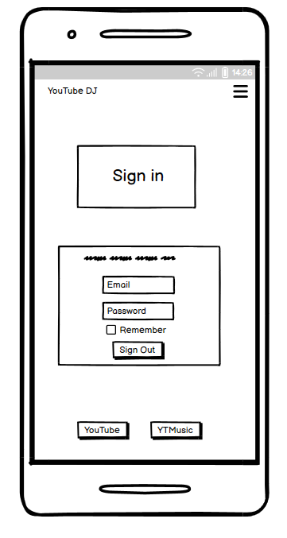
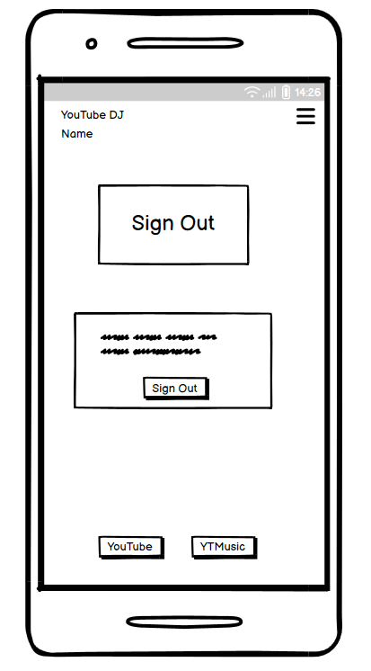

# YouTube DJ
## YouTube DJ plays all YOUR hits!

The key idea of this project is to make an easy UI for making collaborative playlists on youtube music.

## Table of contents
Introduction
Design
Features
Deployment
Testing

Welcome to YouTube DJ, a webapp designed to enable collaborative YouTube playlist management. I was inspired to design this webapp based on an experience I had this past Easter. During the celebration with my wife's immediate family, we listened to music. This was done by passing around a single phone and having family members select one song at a time. It seemed to me that it would be convenient to have a way for us to all add songs independently via our own devices. This app enables that while allowing the "owner" of the queue to maintain control.

## Design

### Design Layout and Scaling
I have tried to lay the website out in a way that is visually acceptable to me. I have a visual disability which means that I view things zoomed in and in a dark color scheme. This makes it difficult to address responsiveness as in chrome dev tools there is not only the slider for controlling the size of the display but something to also control how zoomed in the display is. I decided to use what ever default zoom chrome presented me with as this is not something I can control on the user end. This may explain some of my design choices in terms of positioning and scaling.

### Wireframes
I made various wireframes during my work on this project. At times, the final project differed from these wireframes. This is because I either felt the I liked what was displayed on screen better than my initial design with the wireframe or because there may have been an issue getting the page to look 100% how I wanted with the wireframe. As I am new to wireframes and Balsamiq, they do not include the best assets, like rounded buttons or containers.

I used Balsamiq to make all of the wireframes.

#### Landing Pages
Here are the Mobile and Desktop versions of the Landing page.

Mobile Landing Page        |  Desktop Landing Page
:-------------------------:|:-------------------------:
  |  

Here are the mobile Login, Logout, and Signup pages. They differ only from the desktop version in the size of the containers and the navbar elements. I therefore did not make wireframes for the desktop versions of these pages.

Login  | Logout       |  Sign Up
:----------------:|:---------:|:----------------:
  |  |  

These are the m
## Features

### Future Directions
There are several different avenues for future development.

1. The implementation of 4 character codes used to share queues instead of links.
2. The easy transition from Guest user to authenticated user. This would mean, in particular, that the queue initial queue that brought the user to the site would be added to their list of collaborative queues automatically.
3. Queue sharing links updating/expiring. That is to say that the link used to share a queue would expire after a certain amount of time.
4. Taking location into account as not all YouTube videos are accessible in all locations.
5. Being able to determine the privacy status of an uploaded playlist. Currently this is set to unlisted.
6. Enabling other user's to have more control over queues, such as the ability to remove entries or reorder them.
7. Enabling syncing of queues with published playlists so that a queue will reflect songs added to the playlist through YouTube.
8. Enable "friends" or "Frequent Collaborators" and browsing features so that you can see what queues other people are working on/have and request permissions to collaborate on them.
9. Enable better "Share" functionality. Right now, one must copy the link associated to the share button. Instead, it would be nice if for mobile devices it opened the share menu and on desktop it copied the address automatically when you clicked it.
10. Increasing the size of Queues and the number of max search results. This artifical limit is imposed due to the rate limit of the YouTube Data API.

## Deployment

### Setting up APIs

#### Setting up Google Cloud platform project
1. Navigate to console.cloud.google.com while logged in to a your (personal) google account.

2. Click on the project selection menu and click "New Project." Enter a project name, select "No organization," and click "Create."

#### Youtube API without Oauth notes
These will likely be irrelevant, but just in case I am taking notes as I set it up.

1. Click on "Library" in the panel on the left. Enter "Youtube Data API" in the search field and hit enter. Then select "Youtube Data API v3" and click "Enable."

2. Click on "Create Credentials." Make sure that "Youtube Data API v3" is selected under "Which API are you using?" Select "Public data" under "What data will you be accessing?" Then click "Next."

3. Copy the API key and save it in your `env.py` file as `ytp_api_key`. Make sure that your `env.py` file is listed in your `.gitignore` file.

4. Will this need to be restricted? Who knows? attention

#### Youtube API with Oauth notes

1. Click on "Library" in the panel on the left. Enter "Youtube Data API" in the search field and hit enter. Then select "Youtube Data API v3" and click "Enable."

2. Click on "Create Credentials." Make sure that "Youtube Data API v3" is selected under "Which API are you using?" Select "User data" under "What data will you be accessing?" Then click "Next."

3. Enter an appropriate app name, user support email, and developer contact information. Click "Save and Continue."

4. Click on "Add or Remove Scopes." Add "youtube" to the filter to narrow down the options. Select ".../auth/youtube.readonly" as well as ".../auth/youtube" and click on "Update" at the bottom of the screen. Click "Save and Continue."

5. Under "Application type," select "Web application." Enter an appropriate name for your Oauth client. Add the relevant URI's for authorized Javascript origins and redirect requests (such as a local address or that of a heroku app). Click "Create."
Make sure that when you add the URIs that you have the trailing slash there appropriately.

6. Copy your client ID and save it in your env.py file. Download the credentials. Save this JSON file in your local repository under the name `oauth_yt_creds.json`.

Request details: redirect_uri=http://localhost:8080/ flowName=GeneralOAuthFlow

add two cofnig vars, then use the heroku cli to login and write one of them to a specific file. 
heroku run bash -a pp4-playlist-manager
After logging into the app, enter the command `echo ${GOOGLE_CREDENTIALS} > oauth_creds.json` where the value of google credentials is the contents of your local credentials file.

when adding address for the db remove the quotes.

external user, enter your email address

## Testing
Do to the extensive mature of testing on this project, there is a separate document that addresses this portion of the readme, it can be found here: Link

## References

### StackOverflow

#### Git
1. [Reverting a repo to previous commit](https://stackoverflow.com/questions/4114095/how-do-i-revert-a-git-repository-to-a-previous-commit)
2. [Handling "not valid JSON" error with Fetch API](https://stackoverflow.com/questions/75335819/how-to-fix-syntaxerror-unexpected-token-doctype-is-not-valid-json)
3. [Error with Fetch API doctype](https://stackoverflow.com/questions/76046962/uncaught-in-promise-syntaxerror-unexpected-token-doctype-is-not)
4. [Issue with removing custom manager](https://stackoverflow.com/questions/14723099/attributeerror-manager-object-has-no-attribute-get-by-natural-key-error-in)
5. [CSRF and Oauth issue](https://stackoverflow.com/questions/69561231/getting-insecure-transport-oauth-2-must-utilize-https-with-cert-managed-by-her)
6. [Django test with post request](https://stackoverflow.com/questions/42628439/how-to-perform-a-django-test-with-a-request-post)
7. [Mismatching state in API request](https://stackoverflow.com/questions/61922045/mismatchingstateerror-mismatching-state-csrf-warning-state-not-equal-in-reque)
8. [Non-serializeable default values in Django models](https://stackoverflow.com/questions/67771130/django-2-2-cannot-serialize-default-values-once-migration-has-been-done)
9. [Get value of Django model field](https://stackoverflow.com/questions/51905712/how-to-get-the-value-of-a-django-model-field-object)
10. [Multiple parameters in Django url patterns](https://stackoverflow.com/questions/51464131/multiple-parameters-url-pattern-django-2-0)
11. [Background of input elements](https://stackoverflow.com/questions/5617703/background-color-in-input-and-text-fields)
12. [Django model error with one-to-many relationships](https://stackoverflow.com/questions/77620789/django-4-valueerror-mymodel-instance-needs-to-have-a-primary-key-value-befor)
13. [Using html in Django messages](https://stackoverflow.com/questions/2053258/how-do-i-output-html-in-a-message-in-the-new-django-messages-framework)
14. [Property and Class methods](https://stackoverflow.com/questions/128573/using-property-on-classmethods)
15. [Logging in user for Django tests](https://stackoverflow.com/questions/9332541/django-get-user-logged-into-test-client)
16. [Navigating Heroku server files](https://stackoverflow.com/questions/38924458/how-to-see-files-and-file-structure-on-a-deployed-heroku-app)
17. [Auto upstreaming new branches](https://stackoverflow.com/questions/29422101/automatically-track-remote-branch-with-git)
18. [Test Django redirects](https://stackoverflow.com/questions/14951356/django-testing-if-the-page-has-redirected-to-the-desired-url)
19. [Override bootstrap with custom CSS](https://stackoverflow.com/questions/20721248/how-can-i-override-bootstrap-css-styles)
20. [Getting google credentials on Heroku](https://stackoverflow.com/questions/47446480/how-to-use-google-api-credentials-json-on-heroku)
21. [Getting user data from Oauth tokens](https://stackoverflow.com/questions/64295394/how-do-i-find-a-users-youtube-channel-from-oauth-client-authentication)
22. [Refresh token error](https://stackoverflow.com/questions/60401040/getting-invalid-scope-when-attempting-to-obtain-a-refresh-token-via-the-google-a/78599979#78599979)
23. [jQuery and getElementById return different results](https://stackoverflow.com/questions/6650037/getelementbyid-and-jquery-not-returning-same-result)
24. [Socket already in use](https://stackoverflow.com/questions/4465959/python-errno-98-address-already-in-use)
25. [Killing a process from the terminal](https://stackoverflow.com/questions/4465959/python-errno-98-address-already-in-use) 
26. [Fix initial migration and custom user issue](https://stackoverflow.com/questions/65562875/migration-admin-0001-initial-is-applied-before-its-dependency-app-0001-initial-o)
27. [Math inside Django template](https://stackoverflow.com/questions/6285327/how-to-do-math-in-a-django-template)
28. [Return a JSON response object with Django](https://stackoverflow.com/questions/67517802/how-to-return-json-response-from-views-py-instead-of-html-file-in-django)
29. [Using Django JSONResponse objects](https://stackoverflow.com/questions/2428092/creating-a-json-response-using-django-and-python)
30. [History in VSCode](https://stackoverflow.com/questions/46446901/how-can-i-see-local-history-changes-in-visual-studio-code)
31. [Unlinking db issue](https://stackoverflow.com/questions/4389833/unlink-of-file-failed-should-i-try-again)
32. [Unicode character decoding](https://stackoverflow.com/questions/27092833/unicodeencodeerror-charmap-codec-cant-encode-characters)
33. [Using Django sessions](https://stackoverflow.com/questions/7763115/django-passing-data-between-views)

#### Other references
1. [Using Allauth and Oauth together](https://medium.com/@ksarthak4ever/django-custom-user-model-allauth-for-oauth-20c84888c318)
### YouTube tutorial
The following tutorials were good starts. The YouTube and Oauth tutorials didn't cover a lot of what I ended up doing. Nonetheless, they were helpful.
1. [Corey Schafer: YouTube API tutorial](https://www.youtube.com/watch?v=th5_9woFJmk)
2. [Corey Schafer: Oauth and YouTube API tutorial](https://www.youtube.com/watch?v=vQQEaSnQ_bs)
3. [Fetch JS API tutorial](https://www.youtube.com/watch?v=uBR2wAvGces)