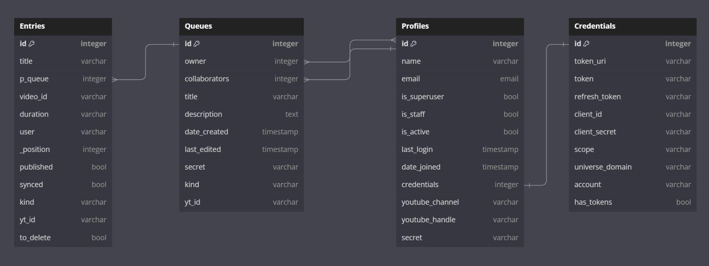

# YouTube DJ
## YouTube DJ plays all YOUR hits!

The key idea of this project is to make an easy UI for making collaborative playlists on youtube music.

## Table of contents
Introduction
Design
Features
Deployment
Testing

## Introduction
Welcome to YouTube DJ, a webapp designed to enable collaborative YouTube playlist management. I was inspired to design this webapp based on an experience I had this past Easter. After Easter Brunch with my wife's immediate family, we listened to music. This was done by passing around a single phone and having family members select one song at a time. It seemed to me that it would be convenient to have a way for us to all add songs independently via our own devices. This app enables that while allowing the "owner" of the queue to maintain control. This control might be necessary to ensure that everyone gets a chance to hear a song they like, not just the person who is the fastest. Or it might be necessary if someone in the group is immature (like a 12 year old per se).

### Core Concept
The core of essence of the app is 3 pillars:
1. Creating playlists,
2. Sharing playlists,
3. Uploading playlists to YouTube (as the app itself doesn't have a player (yet)).

For clarity, we refer to playlists created with the app as queues and playlists on YouTube as playlists. We use the term owner to mean the person who created the queue. Other users, guests or authenticated, are simply users. We call the act of uploading a playlist to YouTube as publishing. This required using Oauth 2.0 to obtain user permissions. As the project has not been verified by Google, the full use of the app is restricted to users on the list of Test Users. If you would like to be added, please contact me at seantilson@gmail.com. (If you are the assessor, you should have been provided with credentials for such an account already.)

### Ideal Usage scenario
Ideally, a user with an account will create a queue and then send the share link to multiple friends they are present with. These users can either make an account or sign in as a guest. Then they would add videos to the queue. The owner (initial user) would then publish the queue to YouTube, periodically tinker or add their own videos, and sync the queue while it is actively playing. Through manual testing we have discovered that the YouTube playlist only updates when moving to the next track. This is likely unavoidable since it involves the behavior of YouTube itself.

## Design

### Design Layout and Scaling
I have tried to lay the website out in a way that is visually acceptable to me. I have a visual disability which means that I view things zoomed in and in a dark color scheme. This makes it difficult to address responsiveness as in chrome dev tools there is not only the slider for controlling the size of the display but something to also control how zoomed in the display is. I decided to use what ever default zoom chrome presented me with as this is not something I can control on the user end. This may explain some of my design choices in terms of positioning and scaling.

### Color Scheme
I used Color Pick Eyeydropper (a chrome extension) to sample different colors from the YouTube home page. I did adjust them to suit my personal taste. I also used blah to create a gradient that transitions between the initial choice for a background color and the chosen color for the header and footer. I stuck with some of the standard Bootstrap and Django design choices (for Success/Danger buttons and messages respectively) as they are common enough that the user will be familiar with their implicit meaning. As mentioned above, I have a visual impairment and that is why my color schemes dark colors with white text.

### Wireframes
I made various wireframes during my work on this project. At times, the final project differed from these wireframes. This is because I either felt the I liked what was displayed on screen better than my initial design with the wireframe or because there may have been an issue getting the page to look 100% how I wanted with the wireframe. As I am new to wireframes and Balsamiq, they do not include the best assets, like rounded buttons or containers.

I used Balsamiq to make all of the wireframes.

Mobile and Desktop Landing pages

Mobile Landing Page        |  Desktop Landing Page
:-------------------------:|:-------------------------:
  |  

Mobile Login, Logout, and Sign up pages

Login  | Logout       |  Sign Up
:----------------:|:---------:|:----------------:
  |  |  

The above differ only from the desktop versions in the size of the containers and the navbar elements. I therefore did not make wireframes for the desktop versions of these pages.

Mobile Navigation menus

Nav: Logged In        |  Nav: not Logged In
:-------------------------:|:-------------------------:
  |  

Mobile and Desktop Profile page

Top of Profile page     |  Mobile Queues Display | Desktop Profile page
:-------------------------:|:---------------:|:----------:
  |  |

Mobile Create Queue page

  

The mobile and desktop Create Queue pages differ only in the size and the nav elements so I did not make a wireframe for the desktop version.

Mobile Edit Queue page

Top of Edit page     |  Search Results and Queue entries
:-------------------------:|:---------------:
  |  

Desktop Edit Queue page

Top of Edit page     |  Search Results and Queue entries
:-------------------------:|:---------------:
  |  

Profile page

Top of Profile page     |  Mobile Queues Display | Desktop Profile page
:-------------------------:|:---------------:|:----------:
  |  |

### Database
At the core of the project are two main objects: Profiles  (users), and Queues (playlists). Profiles are built on top of the All-Auth AbstractBaseUser model. They have a reference to a Credentials model, which is made to store the tokens obtained using Oauth 2. Queues (our playlists) are comprised of entries (YouTube videos). Entries store references to YouTube videos as well as the relative position in the queue. Note that Queues have both an owner (many queues to one profile) and collaborators (many queues to many profiles) relationships. In the ERD, the lines demonstrating this cross, this is due to the representation made by dbdiagram.io, I was unable to fix this.

Entity Relationship Diagram

## Features

### Account Creation
The user can create an account using the Django All-Auth library. This involves a sign up page, a login page, and a logout page. It is possible to have the webapp remember your login credentials. There is no username field, this can be set from the profile page.

Sign Up

### Landing Page
The Landing page gives a brief introduction to the site with an explanation of the features.

Landing page

### Authentication
Users can pair their account with a YouTube account. This will allow users to publish their queues to YouTube, making associated YouTube playlists. This is discussed more in the YouTubePlaylist section below. Users can also revoke these permissions. Our code to revoke credentials will always purge the records from our system. It does not, however, consistently invalidate the credentials on Google's end. We have therefore included feedback to the user encouraging them to visit the relevant google page (a link is provided in the feedback message).

Profile Page Info Section
Without Credentials | With Credentials | Error Message
:--:|:--:|:--:
||

The button changes depending on whether or not the user has successfully paired a YouTube account.
### Navigation
There is a navigation bar which allows the user to visit different parts of the site. In mobile, this is an accordion/dropdown style menu. The Options for navigation depend on whether or not the user is logged in. When not logged in, the user can navigate to the Home, Login, or Sign Up page. When Logged in, the user can navigate to the Home, Profile, Logout, or Create Queue page.

Mobile Nav Menu

Logged In | Not Logged In | Collapsed
:--:|:--:|:--:
||

Desktop Nav Menu

Logged In

Not Logged In

|

In the footer, there are links to both YouTube and YT Music where the playlists can be accessed in general.

Footer Links

### Profile page
Every user has a profile page. It contains some personal data, links to authorization, the create queue page, a form for setting the name (cosmetic), and lists of queues owned by the user and queues they are collaborators on.

Profile page

#### Setting Name
The name is primarily cosmetic. It lets other users know who owns each queue and who added each entry. It can be reset by the user. The default value is the portion of the users email address before '@'. This is in the upper right of the above image.

#### Queue Lists
This section enumerates the queues that the user has access to. On the left are the queues owned by the user. On the right are queues owned by other users. The title of each queue is a link to the edit page for the given queue. These are in the lower half of the above image.

### Queues
Queues is the apps version of a playlist. Videos (entries) can be added from YouTube simultaneously by multiple users (provided they have been invited to do so by the owner of the queue). While collaborators have the ability to add videos, only the owner has the ability to interact with the queue in other ways. This includes removing entries, reordering entries, publishing a queue to YouTube, unpublishing a queue (removing it from YouTube), syncing a queue (updating the playlist on YouTube to reflect any changes), deleting a queue, or sharing a queue (inviting someone to collaborate). These different actions will be discussed in detail below. Collaborators (as well as owners) are also able to open find the playlist on youtube through a link. The playlists are published to youtube as unlisted (at this stage of the project).

#### Create Queue
Any logged in user can create a queue. There is a link on the profile page which takes users to the Create Queue page. Once their, they can enter a title (required) and a description of the queue. The description is optional and will be visible to all users. After creating, the user is redirected to the Edit Queue page for the newly created queue.

Create Queue

#### Share Queue
An owner has the ability to invite others (not necessarily users with accounts) to collaborate (add videos) to the queue. The link to do this can be copied from the share button present on the Edit Queue page as well as the users profile page (underneath each queue). Entering this link will bring the (potential) user to a guest sign in page. After creating a guest account (not stored in the database and email is optional), they re taken to the Edit page for the queue.

Guest Sign In

If the user already has an account, they can click the link to be redirected to the user login page. Upon login, they are added as a collaborator for the queue, and are redirected to the appropriate Edit page. They can then search for and add videos from youtube.

If the app already has an account stored (through the "Remember me" feature from All-Auth), the user will be added as a collaborator for the queue and automatically redirected to the Edit Queue page for the associated queue.

This queue will then be listed under "Friends' Queues" on the users profile page.

#### Edit Queue
The Edit Queue page contains many features. There is some metadata about the queue, such as who created it, the description, how many entries are on it, and a link to the published playlist (if published). There is a "Control Panel" with various buttons. There is a search bar where users can search YouTube for entries to add. The user can also see what entries are already in the queue as well as their relative position. On mobile devices, the search results appear before the current queue entries. On larger devices, the search results and current queue entries appear side by side.

Most of the features below provide the user with feedback using Django's message framework. Changing the position of entries is the only feature that does not provide the user with feedback.

##### Control Panel
The buttons displayed depend on the status of the user (owner vs collaborator/guest and whether or not the account is connected to YouTube), as well as the state of the queue (published vs unpublished and syncd vs unsynced). Here is a display of all possible buttons. Depending on the size of the display, the buttons appear on either a single or two rows.

Control Panel

Refresh: refreshes the page to update the queue. This will show changes that new entries that other collaborators have added as well as changes the owner may have made. All users see this button.

Share: link to share/invite other users to collaborate on the playlist. It must be copied and sent to other users via a messaging service. Only available for queue owner.

Sync: updates playlist on YouTube to match the queue. Currently, this only functions properly when edits have not been made on YouTube directly. Only available for queue owner with paired YouTube account and only when queue is published but out of sync (differs from the published playlist in some way).

Publish: creates a YouTube playlist containing videos from the queue in the specified order. Only available for queue owner with paired YouTube account and only when queue is not published.

Unpublish: removes playlist from YouTube. Only available for queue owner with paired YouTube account and only when queue is published. This does not delete the local queue. The user is prompted before the action takes place using a modal.

Delete: deletes the queue from YouTube DJs database. Only available for queue owner. This does not remove the playlist from YouTube. The user is prompted before the action takes place using a modal.

##### Search YouTube & Adding Entries
From the Edit page, users can search YouTube for videos to add. Currently, the number of results is capped. This limit is related to the API rate limit. The previous search results are loaded by default for each queue, if they are still present in the session.

Search Bar | Search Results
:--:|:--:
|

Next to each result is an "Add" button which will add a video to the end of the queue as a new entry. The name of the result also serves as a link to the video on YouTube.

Currently, the length of queues is capped at 10. This is a design decision as queues are meant to be temporary and active, for the moment, so to say.

##### Reorder & Remove Entries
The owner of the queue can reorder and remove entries. "Up" and "Down" move the entry one position up or down respectively. They have no effect on an entry at the beginning or end of the queue, respectively. The can swap the position of two entries by entering the position the user wants the entry to occupy into the input field (a possible range is listed as a placeholder) and then clicking the swap button. On mobile devices, the swap input and button are removed for design reasons.

### Future Directions
There are several different avenues for future development.

1. 4 character codes used to share queues instead of links.
2. Easy transition from Guest user to authenticated user.
3. The link used to share a queue would expire after a certain amount of time.
4. Taking location into account as not all YouTube videos are accessible in all locations.
5. Being able to determine the privacy status of an uploaded playlist. Currently this is set to unlisted.
6. Enabling other user's to have more control over queues, such as the ability to remove entries or reorder them.
7. Enabling syncing of queues with published playlists so that a queue will reflect songs added to the playlist through YouTube.
8. Enable "friends" or "Frequent Collaborators" and browsing features so that you can see what queues other people are working on/have and request permissions to collaborate on them.
9. Enable better "Share" functionality such as using the "share" button on mobile devices.
10. Increasing the size of Queues and the number of max search results. This artificial limit is imposed to limit usage of the YouTube Data API.
11. Addressing foreign and special characters that show up in search results.
12. Automatic syncing of queues with published playlists.
13. Implementing more of the CRUD functionality with the Fetch API so that the screen doesn't need to refresh.

## Deployment
There are both local and remote deployment options. We explain how to 

### Setting up APIs

This will require both a Google Cloud Platform account and a Heroku account. We utilize two different sets of credentials for the YouTube Data API. The first is for read only tasks, such as searching and retrieving video ID's for search results. The second is for creating and editing YouTube playlists.

#### Youtube API without Oauth notes

1. Navigate to the "Library" of APIs from the dashboard of your project on the Google Cloud Platform. Find "Youtube Data API v3" and click "Enable."

2. Click on "Create Credentials." Make sure that "Youtube Data API v3" is selected under "Which API are you using?" Select "Public data" under "What data will you be accessing?"

3. Copy the API key and save it in your `env.py` file as `ytp_api_key`. Make sure that your `env.py` file is listed in your `.gitignore` file.

#### Youtube API with Oauth notes

1. Click on "Create Credentials." Make sure that "Youtube Data API v3" is selected under "Which API are you using?" Select "User data" under "What data will you be accessing?"

2. Enter an appropriate app name, user support email, and developer contact information. Click "Save and Continue."

3. Click on "Add or Remove Scopes." Add "youtube" to the filter to narrow down the options. Select ".../auth/youtube" and click on "Update" at the bottom of the screen. Click "Save and Continue."

4. Under "Application type," select "Web application." Enter an appropriate name for your Oauth client. Add the relevant URI's for authorized Javascript origins and redirect requests (such as a local address or that of a heroku app). Click "Create."
Make sure that when you add the URIs that you have the trailing slash there appropriately.

6. Copy your client ID and save it in your env.py file. Download the credentials. Save this JSON file in your local repository under the name `oauth_yt_creds.json`.

Request details: redirect_uri=http://localhost:8080/ flowName=GeneralOAuthFlow

#### Local Settings

If running the project locally, you will have to set several environment variables. This is done by creating an env.py file, importing `os`, and using the function `os.environ.setdefault`. The files written in the repository will function appropriately if you pass the variable name as the first value and the value as the second. In particular, the line 

`os.environ.setdefault("LOCAL","True")` 

should appear at the top, this is used throughout the project to let it know, for example, which URI to use. The other environment variables you will need to set this way are:

`YOUTUBE_API_KEY`
`DATABASE_URL`
`SECRET_KEY`

The value of `YOUTUBE_API_KEY` is obtained above. If you are happy to use the default SQLite database, then `DATABASE_URL` is unnecessary. `SECRET_KEY` can be generated with [Django Secret Key Generator](https://djecrety.ir/).

The Oauth credentials should be saved in the root of your project, as described above.

Find `REDIRECT_URI` and change it to either the local or the remote redirect URI you used when setting up Oauth 2 for the project on the Google Cloud Platform.

#### Local Deployment

To run the project locally, clone the repository. Install the requirements from the requirements.txt file using `pip`. Initialize the database with `python manage.py migrate` and then `python manage.py runserver` (or perhaps first create a super user using `python manage.py createsuperuser`).

#### Heroku Settings

We will need to set some Config Vars for the app to function on Heroku properly.

- `DATABASE_URL` should be set to whatever the URL is of the database you are using in production.
- `GOOGLE_CREDENTIALS` should be set to the value of the JSON file containing your Oauth credentials obtained above.
- `LOCAL` should be set to `False`.
- `PORT` should be set to `8000`.
- `SECRET_KEY` should be set to the appropriate value.
- `YOUTUBE_API_KEY` should be set to the appropriate value.

After these are set, use the Heroku CLI to login to the project by entering `heroku run bash -a <your-project-name>`. Enter the command `echo ${GOOGLE_CREDENTIALS} > oauth_creds.json`. This will write the contents of the config var `GOOGLE_CREDENTIALS` to a file on your server with the appropriate name.

#### Heroku Deployment

Clone the GitHub repository. After setting up the above config vars, select the python buildpack. Navigate to the Deployment page. Associate a Heroku project with your GitHub account. Connect the Heroku app to the cloned GitHub repository. Scroll down to manual (or automatic) deploy, select the main branch and click deploy.

## Testing
Do to the extensive mature of testing on this project, there is a separate document that addresses this portion of the readme, it can be found here: Link

## References

### Technologies Used
Programming languages/Frameworks: Python, Django, Javascript, Fetch, Bootstrap, HTML, CSS.

Design Tools: dbdiagram.io (Entity Relationship Diagrams), Balsamiq (Wireframes), Snipping Tool (Windows program for cropping images), Color Pick Eyedropper (Chrome extension for finding color hex codes)

AI: I used the Codeium plug-in for VS Code. I used it to as for an informed auto-complete as well as to help with generating docstrings (although its suggestions were surprisingly not uniform).

### Individuals
- My mentor Anthony for links to other pp4 examples, helping my focus on an mvp, and organize my priorities. 
- Kay, my CI cohort facilitator, for links to good readme examples and references, helpful information regarding the project, and a very necessary pep talk!
- Anders, my fellow student, for useful discussions during development and the tip about using `form.as_div` to avoid html validation issues.
- Tarek, my fellow student, for useful discussions during the development of the project as well as some early manual testing help.
- Karl, my fellow student, for pointing me towards the Fetch API and explaining its fundamental principles.
- Sean Meade, a former student, for helping me set up my local development environment when Gitpod was causing issues with Oauth.
- Andy and Meg, my brother and sister, for help with manual testing and feedback about design.

### StackOverflow

#### Non-code issues
1. [Reverting a repo to previous commit](https://stackoverflow.com/questions/4114095/how-do-i-revert-a-git-repository-to-a-previous-commit)
2. [Auto upstreaming new branches](https://stackoverflow.com/questions/29422101/automatically-track-remote-branch-with-git)
3. [Socket already in use](https://stackoverflow.com/questions/4465959/python-errno-98-address-already-in-use)
4. [Killing a process from the terminal](https://stackoverflow.com/questions/4465959/python-errno-98-address-already-in-use) 
5. [History in VSCode](https://stackoverflow.com/questions/46446901/how-can-i-see-local-history-changes-in-visual-studio-code)
6. [Display images side by side in markdown](https://stackoverflow.com/questions/24319505/how-can-one-display-images-side-by-side-in-a-github-readme-md)
7. 

#### Code related
1. [Handling "not valid JSON" error with Fetch API](https://stackoverflow.com/questions/75335819/how-to-fix-syntaxerror-unexpected-token-doctype-is-not-valid-json)
2. [Error with Fetch API doctype](https://stackoverflow.com/questions/76046962/uncaught-in-promise-syntaxerror-unexpected-token-doctype-is-not)
3. [Issue with removing custom manager](https://stackoverflow.com/questions/14723099/attributeerror-manager-object-has-no-attribute-get-by-natural-key-error-in)
4. [CSRF and Oauth issue](https://stackoverflow.com/questions/69561231/getting-insecure-transport-oauth-2-must-utilize-https-with-cert-managed-by-her)
5. [Django test with post request](https://stackoverflow.com/questions/42628439/how-to-perform-a-django-test-with-a-request-post)
6. [Mismatching state in API request](https://stackoverflow.com/questions/61922045/mismatchingstateerror-mismatching-state-csrf-warning-state-not-equal-in-reque)
7. [Non-serializeable default values in Django models](https://stackoverflow.com/questions/67771130/django-2-2-cannot-serialize-default-values-once-migration-has-been-done)
8. [Get value of Django model field](https://stackoverflow.com/questions/51905712/how-to-get-the-value-of-a-django-model-field-object)
9. [Multiple parameters in Django url patterns](https://stackoverflow.com/questions/51464131/multiple-parameters-url-pattern-django-2-0)
10. [Background of input elements](https://stackoverflow.com/questions/5617703/background-color-in-input-and-text-fields)
11. [Django model error with one-to-many relationships](https://stackoverflow.com/questions/77620789/django-4-valueerror-mymodel-instance-needs-to-have-a-primary-key-value-befor)
12. [Using html in Django messages](https://stackoverflow.com/questions/2053258/how-do-i-output-html-in-a-message-in-the-new-django-messages-framework)
13. [Property and Class methods](https://stackoverflow.com/questions/128573/using-property-on-classmethods)
14. [Logging in user for Django tests](https://stackoverflow.com/questions/9332541/django-get-user-logged-into-test-client)
15. [Navigating Heroku server files](https://stackoverflow.com/questions/38924458/how-to-see-files-and-file-structure-on-a-deployed-heroku-app)
16. [Test Django redirects](https://stackoverflow.com/questions/14951356/django-testing-if-the-page-has-redirected-to-the-desired-url)
17. [Override bootstrap with custom CSS](https://stackoverflow.com/questions/20721248/how-can-i-override-bootstrap-css-styles)
18. [Getting google credentials on Heroku](https://stackoverflow.com/questions/47446480/how-to-use-google-api-credentials-json-on-heroku)
19. [Getting user data from Oauth tokens](https://stackoverflow.com/questions/64295394/how-do-i-find-a-users-youtube-channel-from-oauth-client-authentication)
20. [Refresh token error](https://stackoverflow.com/questions/60401040/getting-invalid-scope-when-attempting-to-obtain-a-refresh-token-via-the-google-a/78599979#78599979)
21. [jQuery and getElementById return different results](https://stackoverflow.com/questions/6650037/getelementbyid-and-jquery-not-returning-same-result)
22. [Fix initial migration and custom user issue](https://stackoverflow.com/questions/65562875/migration-admin-0001-initial-is-applied-before-its-dependency-app-0001-initial-o)
23. [Math inside Django template](https://stackoverflow.com/questions/6285327/how-to-do-math-in-a-django-template)
24. [Return a JSON response object with Django](https://stackoverflow.com/questions/67517802/how-to-return-json-response-from-views-py-instead-of-html-file-in-django)
25. [Using Django JSONResponse objects](https://stackoverflow.com/questions/2428092/creating-a-json-response-using-django-and-python)
26. [Unlinking db issue](https://stackoverflow.com/questions/4389833/unlink-of-file-failed-should-i-try-again)
27. [Unicode character decoding](https://stackoverflow.com/questions/27092833/unicodeencodeerror-charmap-codec-cant-encode-characters)
28. [Using Django sessions](https://stackoverflow.com/questions/7763115/django-passing-data-between-views)
29. [404 with a message](https://stackoverflow.com/questions/16367374/django-raising-404-with-a-message)
30. [Depth with box shadow](https://stackoverflow.com/questions/54253830/give-divs-depth-with-css-box-shadow-property)
31. [Last loop in for loop  in Django template](https://stackoverflow.com/questions/837237/how-do-i-check-for-last-loop-iteration-in-django-template)
32. [Webpage not 100% width](https://stackoverflow.com/questions/51453298/webpage-not-100-width)
33. [Using sessions and messages in Django tests](https://stackoverflow.com/questions/23861157/how-do-i-setup-messaging-and-session-middleware-in-a-django-requestfactory-durin)
34. [Testing messages in Django](https://stackoverflow.com/questions/2897609/how-can-i-unit-test-django-messages)
35. [Mocking and patching in unittesting](https://stackoverflow.com/questions/32116085/unit-testing-python-mocking-function-calls-inside-function)
36. [Http errors in python](https://stackoverflow.com/questions/3193060/how-do-i-catch-a-specific-http-error-in-python)
37. [Testing logout with POST method](https://stackoverflow.com/questions/46990392/how-to-test-django-logout-using-client-post)
38. [Get current domain with JS](https://stackoverflow.com/questions/11401897/get-the-current-domain-name-with-javascript-not-the-path-etc)
39. [Content on a single line in Bootstrap](https://stackoverflow.com/questions/42311110/keep-content-in-one-line-in-bootstrap)
40. [Location in Django response object](https://stackoverflow.com/questions/7949089/how-to-find-the-location-url-in-a-django-response-object)
41. [Remove decoration on clicked buttons in Bootstrap](https://stackoverflow.com/questions/19053181/how-to-remove-focus-around-buttons-on-click)

#### Other references
1. [Using Allauth and Oauth together](https://medium.com/@ksarthak4ever/django-custom-user-model-allauth-for-oauth-20c84888c318)
2. [Django Secret Key Generator](https://djecrety.ir/)
3. [CSS Gradient](https://cssgradient.io/)
4. [Real Python article on Mock and Patch](https://realpython.com/python-mock-library/)

### YouTube tutorials
The following tutorials were good starts. The YouTube and Oauth tutorials didn't cover a lot of what I ended up doing. Nonetheless, they were helpful.
1. [Corey Schafer: YouTube API tutorial](https://www.youtube.com/watch?v=th5_9woFJmk)
2. [Corey Schafer: Oauth and YouTube API tutorial](https://www.youtube.com/watch?v=vQQEaSnQ_bs)
3. [Fetch JS API tutorial](https://www.youtube.com/watch?v=uBR2wAvGces)